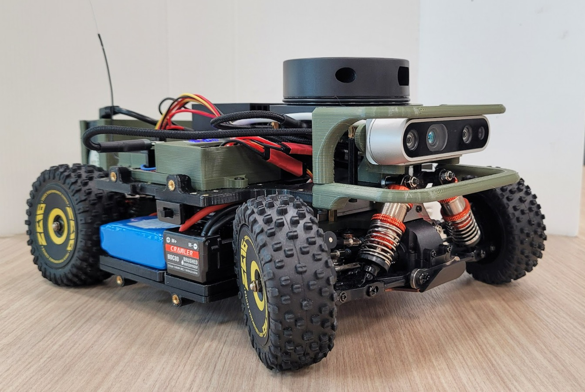
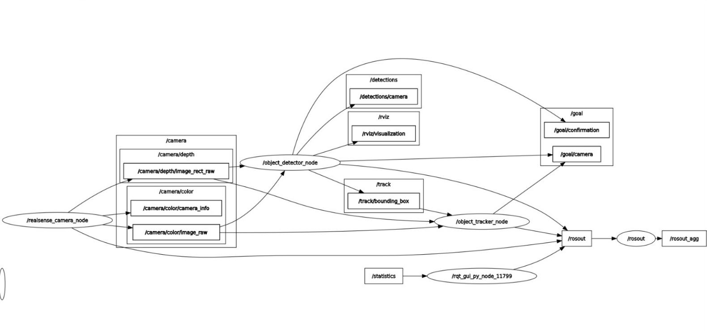
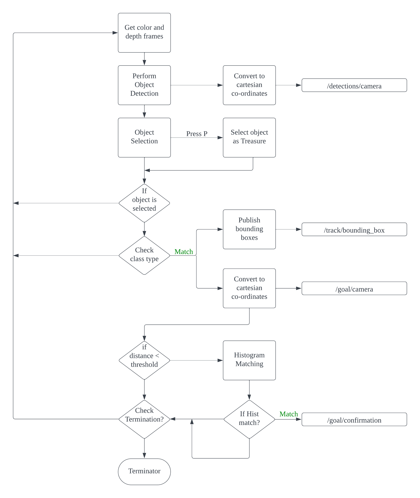

# Perception Pipeline for Autonomous Treasure Hunting Robot


NUS ME5400A FINAL PROJECT
> Authors: Atharva Madkaikar




**Figure 1:** Autonomous Treasure Hunting Robot

## Overview

The project involved developing and testing a Mini Autonomous Driving Platform, focusing on hardware development, perception, localization, and navigation. To address these core areas, we designed and implemented an Autonomous Treasure Hunting Robot capable of exploring an unknown environment and locating a specified treasure object hidden within.

This repository contains the robot's perception stack, which includes two ROS packages: `perception` and `realsense_ros`. The stack can identify static and dynamic obstacles and locate, recognize, and track the specified treasure object when deployed in an environment.

The stack can also be used as a general purpose perception stack for a wide range of AMRs (Autonomous Mobile Robots).




**Figure 2:** Unified Perception Pipeline

## Dependencies

* System Requirements:
    * Ubuntu 20.04, JetPack 5.1 (other versions not tested)
    * ROS Noetic
    * Python 3.8 and above
    * CUDA
    * CUDNN
* Required Python Packages:
    * `opencv-python`
    * `numpy`
    * `pyrealsense2`
    * `deep-sort-realtime`
    * `torch`
    * `torchvision`
    * `tkinter`

**Note:** A pre-trained model of YOLO from Ultralytics has been included in this repo for real-time object detection.
          DeepSort framework has been implemented for real-time object tracking. You can use your custom detection and tracking algorithms
          by making the necessary changes to the source code.

To install these pacakges, run
```bash
# Ultralytics YOLO
pip install ultralytics

# DeepSort Tracking
pip install deep-sort-realtime
```
* Required standard ROS packages:
    * `rospy`
    * `rviz`
    * `std_msgs`
    * `geometry_msgs`
    * `sensor_msgs`
    * `vision_msgs`
    * `cv_bridge`
* Hardware requirements:
    * Nvidia Jetson Orin Nano (will work with other versions)
    * Intel RealSense D435, D435i


## Installation

Before cloning the repo, make sure all the above mentioned Python and ROS dependencies are properly installed. To install this
pipeline on your local hardware, clone the `perception` and `realsense_ros` packages in your ROS workspace.
```bash
# Build the workspace
cd /path_to/your_workspace
catkin_make

# Source
source devel/setup.bash
```

## Usage

The pipeline can be initiated with the following commands
```bash
# Launch the custom ROS wrapper for Intel RealSense Camera
roslaunch realsense_ros realsense_ros.launch

# Launch Detetction and Tracking
roslaunch perception perception.launch
```

This will launch the pipeline. Object tracking is enabled by default and can be toggled off by setting the tracker paramater to **False** during launch.
Disabling object tracking can help minimize GPU utilization and can free up some computational resources.



**Figure 3:** Pipeline Workflow

## Working

* The demo below showcases the working of the Perception stack by selecting and hiding a treasure object (a teddy in this test) within the environment.
* The autonomous robot then explores the room, locates a teddy, and approaches it.
* Once close, the robot extracts the teddy’s color histogram and compares it with the reference histogram of the treasure object.
* If the histograms match, the robot confirms the object as the treasure object.


**Figure 4:** Working of the Perception Stack


The demo below showcases the process of treasure object selection, treasure recognition, and tracking.


**Figure 5:** Treasure Selection, Recognition, and Tracking


**Note:** A detailed explaination of the Perception Stack and it's functionalities can be found in the report included in this repo.


